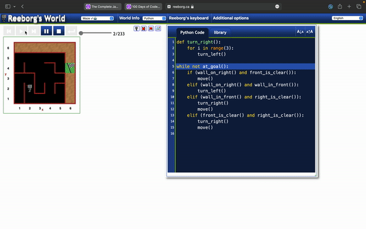
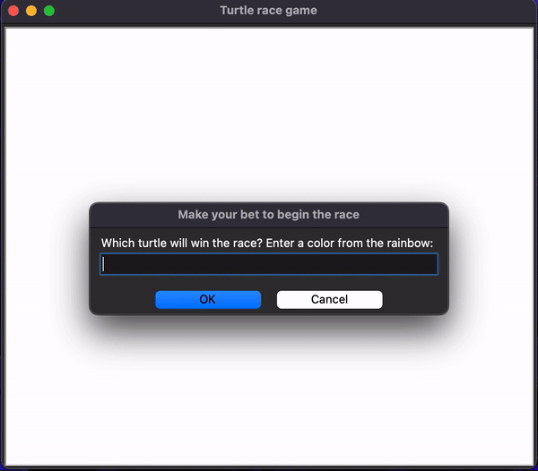
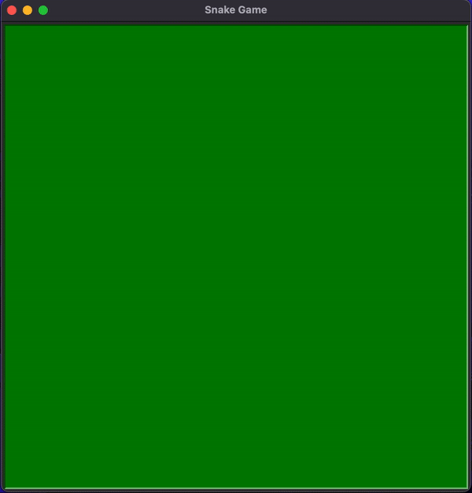
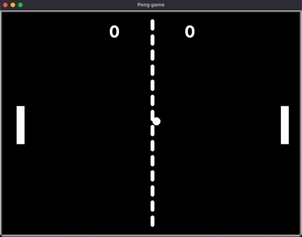
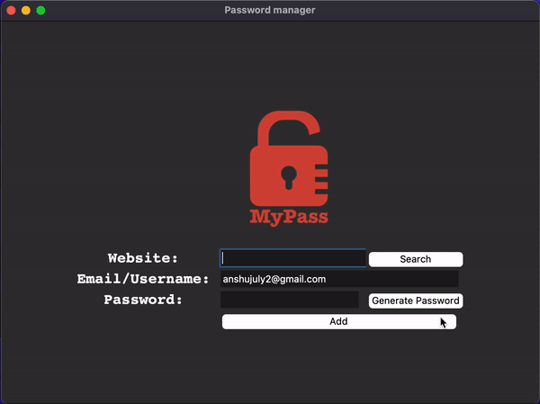
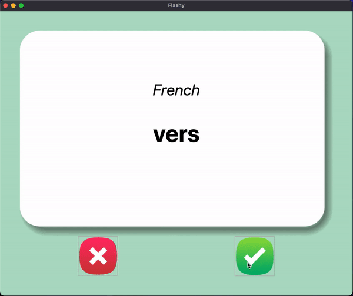
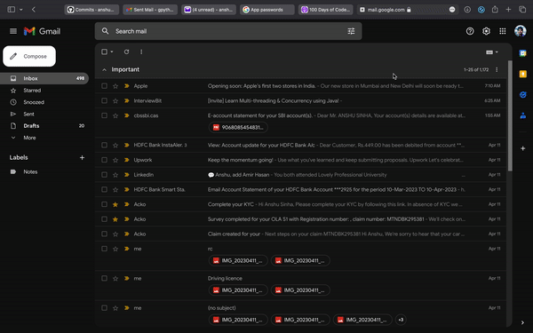
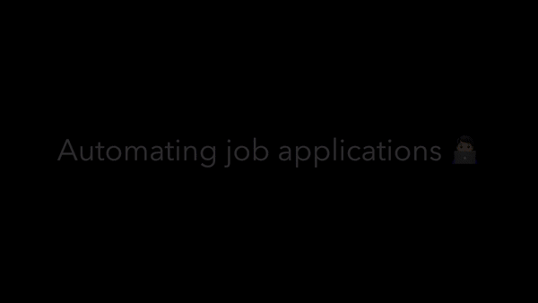
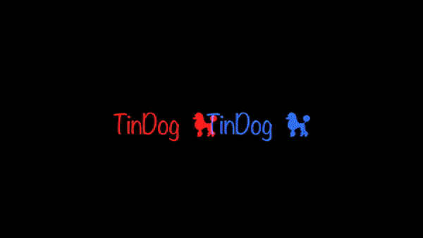

# 🟩 ⏤ Python pro bootcamp ⏤ 🟩

## Table of contents
- [:guitar: Band Name Generator](#:guitar:-band-name-generator)
- [Tip Calculator](#tip-calculator)

# :guitar: Band Name Generator 

This is a simple Python script that generates a band name based on the user's input.

## Usage

1. Run the script in a Python environment.
2. You will be prompted to enter the name of a city.
3. Enter the name of the city and press enter.
4. You will then be prompted to enter the name of a pet.
5. Enter the name of the pet and press enter.
6. The script will print out a band name suggestion by combining the city and pet name.

## Example

```bash
Welcome to the Band Name Generator!
Enter the name of the city: New York
New York
Enter the name of the pet: Luna
Luna
Your band name could be New York Luna
```

# 💵 Tip Calculator

This is a Python script that calculates the amount to be paid by each person when splitting a bill, including the tip.

## Usage

1. Run the script in a Python environment.
2. You will be prompted to enter the total bill amount as a float value.
3. Enter the total bill amount and press enter.
4. You will then be prompted to enter the tip percentage as a float value.
5. Enter the tip percentage and press enter.
6. The script will calculate the total bill amount including the tip.
7. You will be prompted to enter the number of people to split the bill with.
8. Enter the number of people and press enter.
9. The script will calculate the amount to be paid by each individual and print it.

## Example

```bash
Welcome to the Tip Calculator!
What was the total bill? ₹1000
What percentage tip would you like to give? 10
How many people to split the bill with? 5
Each person should pay ₹220.0
```

# 🏝️ Treasure Island

Welcome to the Treasure Island! Your mission is to find the treasure and overcome various obstacles along the way.

## Instructions

1. You will start at a crossroad and need to choose a direction.
   - Type 'l' for 'left' or 'r' for 'right' and press enter.
   - If you choose the wrong direction, the game will end.
   - If you choose the correct direction, you will proceed to the next stage.
2. Next, you will come across a lake with an island in the middle.
   - You have two options: 'wait' for a boat or 'swim' across.
   - Type 'w' to 'wait' or 's' to 'swim' and press enter.
   - If you choose to swim, you will be attacked by an angry trout, and the game will end.
   - If you choose to wait, you will safely reach the island.
3. Upon reaching the island, you will encounter a house with three doors.
   - Choose a door by typing 'r' for 'red', 'y' for 'yellow', or 'b' for 'blue' and press enter.
   - Each door leads to a different outcome.
   - The red door leads to a room full of fire, and the game ends.
   - The yellow door leads to a room full of beasts, and the game ends.
   - The blue door leads to the treasure, and you win the game!

```bash
*******************************************************************************
          |                   |                  |                     |
 _________|________________.=""_;=.______________|_____________________|_______
|                   |  ,-"_,=""     `"=.|                  |
|___________________|__"=._o`"-._        `"=.______________|___________________
          |                `"=._o`"=._      _`"=._                     |
 _________|_____________________:=._o "=._."_.-="'"=.__________________|_______
|                   |    __.--" , ; `"=._o." ,-"'"-._ ".   |
|___________________|_._"  ,. .` ` `` ,  `"-._"-._   ". '__|___________________
          |           |o`"=._` , "` `; .". ,  "-._"-._; ;              |
 _________|___________| ;`-.o`"=._; ." ` '`."\` . "-._ /_______________|_______
|                   | |o;    `"-.o`"=._``  '` " ,__.--o;   |
|___________________|_| ;     (#) `-.o `"=.`_.--"_o.-; ;___|___________________
____/______/______/___|o;._    "      `".o|o_.--"    ;o;____/______/______/____
/______/______/______/_"=._o--._        ; | ;        ; ;/______/______/______/_
____/______/______/______/__"=._o--._   ;o|o;     _._;o;____/______/______/____
/______/______/______/______/____"=._o._; | ;_.--"o.--"_/______/______/______/_
____/______/______/______/______/_____"=.o|o_.--""___/______/______/______/____
/______/______/______/______/______/______/______/______/______/______/[TomekK]
*******************************************************************************

Welcome to the Treasure Island
```

# ✊🏻 ✋🏻 🖖🏻 Rock Paper Scissors

This is a simple Python script that allows you to play the game Rock Paper Scissors against the computer.

## Instructions

1. Run the script in a Python environment.
2. You will be prompted to choose between Rock, Paper, or Scissors.
   - Type 0 for Rock, 1 for Paper, or 2 for Scissors and press enter.
3. The computer will randomly choose its move.
4. The script will display your choice and the computer's choice.
5. The winner of the game will be determined based on the following rules:
   - Rock beats Scissors
   - Scissors beats Paper
   - Paper beats Rock
6. The result of the game will be displayed.

## ASCII Art

The script includes ASCII art for each choice:

- Rock:

```bash
    _______
---'   ____)
      (_____)
      (_____)
      (____)
---.__(___)
```

- Paper:

```bash
    _______
---'   ____)____
          ______)
          _______)
         _______)
---.__________)
```

- Scissors:

```bash
    _______
---'   ____)____
          ______)
       __________)
      (____)
---.__(___)
```

## Example

```bash
What do you choose? Type 0 for Rock, 1 for Paper or 2 for Scissors: 1

You chose:
    _______
---'   ____)____
          ______)
          _______)
         _______)
---.__________)

Computer chose:
    _______
---'   ____)
      (_____)
      (_____)
      (____)
---.__(___)

It's a draw!
```

# 🔑 Password Generator

This is a simple Python script that generates a random password based on the user's input.

## Usage

1. Run the script in a Python environment.
2. You will be prompted to enter the number of letters, symbols, and numbers you want in your password.
3. Enter the desired number for each category and press enter.
4. The script will generate a random password combining lowercase letters, uppercase letters, symbols, and numbers.
5. The password will be shuffled for added security.
6. The final password will be displayed.

## Example

```bash
Welcome to the PyPassword Generator!
How many letters would you like in your password?
8
How many symbols would you like in your password?
3
How many numbers would you like in your password?
2
Here is your password: 4wVj!x6U9Q2%
```

# ꡌ‍ꡙ‍ꡚ Escaping the maze

This is a Python script that provides a universal solution for all challenges in Reeborg's World.

## Introduction

Reeborg's World is an educational platform that allows users to learn programming through interactive challenges. The challenges involve controlling a virtual robot named Reeborg to perform specific tasks in a grid-based environment.

## Universal Solution

The provided code snippet offers a universal solution for all challenges in Reeborg's World, ranging from the "Alone" challenge to the "Maze" challenge. However, the actual solution logic is missing from the code. It seems to define a function turn_right() that turns the robot to the right, and a while loop that executes until the robot reaches the goal.

To complete the code and solve a specific challenge, you need to add the appropriate logic inside the while loop based on the requirements of that particular challenge. This might involve using conditions such as wall_on_right(), front_is_clear(), wall_in_front(), and right_is_clear() to make decisions about the robot's movements and actions.

Feel free to modify the code and add the necessary instructions to solve a specific challenge in Reeborg's World.

## Example

To demonstrate the usage of the code, let's consider a hypothetical challenge where the robot needs to move forward until it reaches the goal:

```python
def turn_right():
    for i in range(3):
        turn_left()

while not at_goal():
    if (wall_on_right() and front_is_clear()):
        move()
    elif (wall_on_right() and wall_in_front()):
        turn_left()
    elif (wall_in_front() and right_is_clear()):
        turn_right()
        move()
    elif (front_is_clear() and right_is_clear()):
        turn_right()
        move()
```



In this example, the robot checks if the front is clear. If it is, the robot moves forward. If there is a wall in front, the robot turns left. This logic will continue until the robot reaches the goal.

Please note that this is just an example, and the actual solution depends on the specific challenge you are working on.

# 🧗🏿‍♂️ Hangman Game

This is a simple implementation of the classic game Hangman. The program randomly selects a word from a predefined list, and the player has to guess the letters in the word to complete it before running out of lives.

```bash
  +---+
  |   |
  O   |
 /|\  |
 / \  |
      |
=========
```

## How to Play

1. Run the main.py file.
2. The program will display the Hangman ASCII art logo.
3. It will then select a random word from the list of words.
4. The word will be displayed as a series of underscores representing the letters.
5. Guess a letter by entering it in the console.
6. If the letter is correct, it will be revealed in the word.
7. If the letter is incorrect, you will lose a life, and a part of the Hangman figure will be displayed.
8. Continue guessing letters until you complete the word or run out of lives.
9. If you complete the word, you win the game.
10. If you run out of lives, you lose the game.

## File Descriptions

- main.py: The main program file that runs the Hangman game.
- hangman.py: Contains the ASCII art representations of the Hangman figure at different stages.
- words.py: Stores the list of words used for the game.

## Prerequisites

Python 3.x

## How to Run

1. Clone the repository or download the project files.
2. Make sure you have Python 3.x installed on your system.
3. Open a terminal or command prompt and navigate to the project directory.
4. Run the following command:

```bash
python main.py
```

5. Follow the instructions in the console to play the game.

Note: You can add or modify the words in the words.py file to customize the game's word bank.

Enjoy playing Hangman!

# 🔐 Caesar Cipher

This project includes two files: main.py and cc.py. The main.py file implements a simple Caesar Cipher encryption and decryption program, while the cc.py file contains the logo for the program.

```bash
 ,adPPYba, ,adPPYYba,  ,adPPYba, ,adPPYba, ,adPPYYba, 8b,dPPYba,
a8"     "" ""     `Y8 a8P_____88 I8[    "" ""     `Y8 88P'   "Y8
8b         ,adPPPPP88 8PP"        `"Y8ba,  ,adPPPPP88 88
"8a,   ,aa 88,    ,88 "8b,   ,aa aa    ]8I 88,    ,88 88
 `"Ybbd8"' `"8bbdP"Y8  `"Ybbd8"' `"YbbdP"' `"8bbdP"Y8 88

           88
           ""             88
                          88
 ,adPPYba, 88 8b,dPPYba,  88,dPPYba,   ,adPPYba, 8b,dPPYba,
a8"     "" 88 88P'    "8a 88P'    "8a a8P_____88 88P'   "Y8
8b         88 88       d8 88       88 8PP        88
"8a,   ,aa 88 88b,   ,a8" 88       88 "8b,   ,aa 88
 `"Ybbd8"' 88 88`YbbdP"'  88       88  `"Ybbd8"' 88
              88
              88
```

## Usage

The main.py file contains the main program logic for the Caesar Cipher. It includes the following functions:

    casesarCipher(command, message, shift): This function takes three arguments: command (either "e" for encoding or "d" for decoding), message (the text to be encoded or decoded), and shift (the number of positions to shift the characters). It performs the Caesar Cipher encryption or decryption based on the command and prints the encoded or decoded result.

The program prompts the user to enter the command, message, and shift value. It then calls the casesarCipher function to process the input and display the result. After each encryption or decryption, the program asks if the user wants to go again. Entering "n" exits the program.

## Getting Started

1. Clone the repository or download the project files.
2. Make sure you have Python 3.x installed on your system.
3. Open a terminal or command prompt and navigate to the project directory.

## Running the Program

To run the program, execute the following command:

```bash
python main.py
```

Follow the prompts in the console to choose the command (encode or decode), enter the message, and specify the shift value. The program will display the encoded or decoded result and ask if you want to go again.

## Example

Here is an example interaction with the program:

```bash
Type 'e' for 'encode' or 'd' for 'decode': e
Type your message (make sure to add only these symbols: space, !, @, #, $, &, ?): hello world
Type the shift number (0-42): 5
Here's the encoded result: mjqqt%ryj%wtaqi
Type 'y' for 'yes' if you want to go again, else type 'n' for 'no': n
Caesar Cipher says: 0mmb6w2bioiqvcbowwlbvqop?
```

Hint: Add all the numbers in the above message and use the result as the shift number to get the decrypted message of Caesar Cipher 😉

# 👨🏻‍⚖️ The Secret Auction Program

This project implements a simple secret auction program using Python. The program allows participants to enter their name and bid amount, and it determines the winner with the highest bid.

```bash
                         ___________
                         \         /
                          )_______(
                          |'''''''|_.-._,.---------.,_.-._
                          |       | | |               | | ''-.
                          |       |_| |_             _| |_..-'
                          |_______| '-' `'---------'` '-'
                          )'''''''(
                         |_________|
                       .-------------.
                      |_______________|
```

## Usage

main.py

The main.py file contains the main program logic for the secret auction. It includes the following functions:

    auction(): This function prompts the user for their name and bid amount, and stores them as key-value pairs in the auctionMembers dictionary.
    The program starts by printing the program logo. It then calls the auction() function to collect the bids from the participants. After all bids are entered, the program determines the winner with the highest bid and displays the result.

The program prompts the user to indicate whether there are any other bidders. Entering "n" ends the auction and proceeds to calculate the winner.

## Getting Started

1. Clone the repository or download the project files.
2. Make sure you have Python 3.x installed on your system.
3. Open a terminal or command prompt and navigate to the project directory.

## Running the Program

To run the program, execute the following command:

```bash
python main.py
```

Follow the prompts in the console to enter the bidder's name and bid amount. If there are more bidders, enter "y" when prompted. Once all bids are entered, the program will display the winner with the highest bid. If no bid is entered or all bids are zero or negative, no winner will be declared.

## Example

Here is an example interaction with the program:

```bash
What is your name?: John
What is your bid?: ₹5000
Are there any other bidders? Type 'y' for 'yes' or 'n' for 'no': y
What is your name?: Jane
What is your bid?: ₹7000
Are there any other bidders? Type 'y' for 'yes' or 'n' for 'no': n
The winner is Jane with a bid of ₹7000
```

# 🧮 Calculator

This program is a simple calculator implemented in Python. It allows users to perform basic arithmetic operations such as addition, subtraction, multiplication, and division.

```bash
 _____________________
|  _________________  |
| | AS           0. | |
| |_________________| |
|  ___ ___ ___   ___  |
| | 7 | 8 | 9 | | + | |
| |___|___|___| |___| |
| | 4 | 5 | 6 | | - | |
| |___|___|___| |___| |
| | 1 | 2 | 3 | | x | |
| |___|___|___| |___| |
| | . | 0 | = | | / | |
| |___|___|___| |___| |
|_____________________|
```

## Usage

main.py

The main.py file contains the main program logic for the calculator. It includes the following functions:

- add(num1, num2): This function takes two numbers as input and returns their sum.
- sub(num1, num2): This function takes two numbers as input and returns their difference.
- mul(num1, num2): This function takes two numbers as input and returns their product.
- div(num1, num2): This function takes two numbers as input and returns their division.

The calc() function is the main entry point of the program. It prompts the user for the first number and the operator symbol (+, -, \*, /). It then asks for the next number and performs the corresponding operation. The result is displayed, and the user can choose to continue with the result or start a new calculation.

## Getting Started

1. Clone the repository or download the project files.
2. Make sure you have Python 3.x installed on your system.
3. Open a terminal or command prompt and navigate to the project directory.

## Running the Program

To run the program, execute the following command:

```bash
python main.py
```

Follow the prompts in the console to enter the numbers and select the desired operation. The calculator will perform the calculation and display the result. You can choose to continue using the result for further calculations or start a new calculation.

## Example

Here is an example interaction with the calculator:

```bash
What's the first number?: 5
+
-
*
/
What's the next number?: 3
5 + 3 = 8
Type 'y' to continue calculating with 8, or type 'n' to start a new calculation: y
+
-
*
/
What's the next number?: 2
8 * 2 = 16
Type 'y' to continue calculating with 16, or type 'n' to start a new calculation: n
```

# 🔢 The Number Guessing Game

This is a simple number guessing game implemented in Python. The program generates a random number between 1 and 100, and the player's objective is to guess the correct number within a limited number of attempts.

```bash
 #####                                                        #     #
#     # #    # ######  ####   ####     ##### #    # ######    ##    # #    # #    # #####  ###### #####
#       #    # #      #      #           #   #    # #         # #   # #    # ##  ## #    # #      #    #
#  #### #    # #####   ####   ####       #   ###### #####     #  #  # #    # # ## # #####  #####  #    #
#     # #    # #           #      #      #   #    # #         #   # # #    # #    # #    # #      #####
#     # #    # #      #    # #    #      #   #    # #         #    ## #    # #    # #    # #      #   #
 #####   ####  ######  ####   ####       #   #    # ######    #     #  ####  #    # #####  ###### #    #
```

## Usage

main.py

The main.py file contains the main program logic for the Number Guessing Game. It includes the following features:

- The logo variable contains an ASCII art logo that is displayed at the start of the game.
- The program prompts the player to choose a difficulty level: 'easy' or 'hard'.
- In the 'easy' mode, the player has 10 attempts to guess the correct number.
- In the 'hard' mode, the player has 5 attempts to guess the correct number.
- After each guess, the program provides feedback to the player if their guess is too low or too high.
- If the player guesses the correct number within the allotted attempts, they win the game.
- If the player runs out of attempts without guessing the correct number, they lose the game.

## Getting Started

1. Clone the repository or download the project files.
2. Make sure you have Python 3.x installed on your system.
3. Open a terminal or command prompt and navigate to the project directory.

## Running the Game

To run the game, execute the following command:

```bash
python main.py
```

Follow the prompts in the console to choose the difficulty level and make guesses. The program will provide feedback on each guess and inform you if you win or lose the game.

## Example

Here is an example interaction with the game:

```bash
Welcome to The Number Guessing Game
I'm thinking of a number between 1 and 100.
Pssst, the correct answer is 42
Chose a difficulty level. Type 'e' for easy and 'h' for hard: e
You have 10 attempts remaining to guess the number.
Make a guess: 50
Too high.
You have 9 attempts remaining to guess the number.
Make a guess: 20
Too low.
You have 8 attempts remaining to guess the number.
Make a guess: 35
Too low.
You have 7 attempts remaining to guess the number.
Make a guess: 42
You got it! The answer was 42.
```

# 🔺 Higher 🔻 Lower Game

This is a simple Higher Lower game implemented in Python. The program presents two data items with descriptions and countries, and the player's objective is to guess which data item has more followers.

```bash
██╗  ██╗██╗ ██████╗ ██╗  ██╗███████╗██████╗     ██╗      ██████╗ ██╗    ██╗███████╗██████╗
██║  ██║██║██╔════╝ ██║  ██║██╔════╝██╔══██╗    ██║     ██╔═══██╗██║    ██║██╔════╝██╔══██╗
███████║██║██║  ███╗███████║█████╗  ██████╔╝    ██║     ██║   ██║██║ █╗ ██║█████╗  ██████╔╝
██╔══██║██║██║   ██║██╔══██║██╔══╝  ██╔══██╗    ██║     ██║   ██║██║███╗██║██╔══╝  ██╔══██╗
██║  ██║██║╚██████╔╝██║  ██║███████╗██║  ██║    ███████╗╚██████╔╝╚███╔███╔╝███████╗██║  ██║
╚═╝  ╚═╝╚═╝ ╚═════╝ ╚═╝  ╚═╝╚══════╝╚═╝  ╚═╝    ╚══════╝ ╚═════╝  ╚══╝╚══╝ ╚══════╝╚═╝  ╚═╝
```

## Usage

main.py

The main.py file contains the main program logic for the Higher Lower game. It includes the following features:

- The logo variable contains an ASCII art logo that is displayed at the start of the game.
- The vs variable contains an ASCII art representation of "vs" to display between the two data items.
- The data variable contains a list of data items, each with a name, description, and follower count.
- The program generates two random data items from the data list and displays them with their descriptions and countries.
- The player is prompted to guess which data item has more followers by typing 'A' for the first item or 'B' for the second item.
- If the player's guess is correct, their score is incremented by 1, and a message with the current score is displayed.
- If the player's guess is incorrect, the game ends, and a message with the final score is displayed.

## Getting Started

1. Clone the repository or download the project files.
2. Make sure you have Python 3.x installed on your system.
3. Open a terminal or command prompt and navigate to the project directory.

## Running the Game

To run the game, execute the following command:

```bash
python higherlower.py
```

Follow the prompts in the console to make your guess. The program will provide feedback on each guess and display your current score. If your guess is incorrect, the game will end, and your final score will be displayed.

## Example

Here is an example interaction with the game:

```bash
Compare A: Instagram, a social media platform, from United States.

██╗   ██╗███████╗
██║   ██║██╔════╝
██║   ██║███████╗
╚██╗ ██╔╝╚════██║
 ╚████╔╝ ███████║
  ╚═══╝  ╚══════╝

Against B: TikTok, a short-form video app, from China.

Who has more followers? Type 'A' or 'B': A
You're right! Current score: 1

Compare A: Facebook, a social networking site, from United States.

██╗   ██╗███████╗
██║   ██║██╔════╝
██║   ██║███████╗
╚██╗ ██╔╝╚════██║
 ╚████╔╝ ███████║
  ╚═══╝  ╚══════╝

Against B: Twitter, a social media platform, from United States.

Who has more followers? Type 'A' or 'B': B
Sorry, that's wrong. Final score: 1
```

# ☕️ Coffee Machine Project

This is a simple coffee machine project implemented in Python. The program simulates a coffee machine that can serve different types of coffee, track resources, and process transactions.

## Usage

main.py

The main.py file contains the main program logic for the coffee machine. It includes the following features:

- The logo variable contains an ASCII art logo that is displayed at the start of the program.
- The resources variable contains a dictionary of available resources for making coffee, such as water, milk, coffee, etc.
- The profit variable keeps track of the total profit made from coffee sales.
- The MENU variable is a dictionary that stores the available coffee options with their respective ingredients and cost.
- The program prompts the user for their desired coffee or other commands.
- The report() function generates a report of the remaining resources and the profit made.
- The resourcesSufficient() function checks if there are sufficient resources to make the requested coffee.
- The processCoins() function processes the coins inserted by the user and returns the total value in dollars.
- The transaction() function handles the transaction by checking if the user's money is enough to make the requested coffee.
- The makeCoffee() function deducts the required ingredients from the resources to make the coffee.
- The program continues to run until the user chooses to exit.

## Getting Started

1. Clone the repository or download the project files.
2. Make sure you have Python 3.x installed on your system.
3. Open a terminal or command prompt and navigate to the project directory.

## Running the Coffee Machine

To run the coffee machine, execute the following command:

```bash
python main.py
```

Follow the prompts in the console to select your desired coffee or perform other commands. The program will display the available resources, process the transaction, and provide the coffee and change if applicable. You can also check the report to see the remaining resources and the profit made.

## Example

Here is an example interaction with the coffee machine:

```bash
         {
      {   }
       }_{ __{
    .-{   }   }-.
   (   }     {   )
   |`-.._____..-'|
   |             ;--,
   |            (__  ;
   |             | )  )
   |             |/  /
   |             /  /
   |            (  /
   \             y'
    `-.._____..-'

Welcome to the Coffee Machine!

What would you like? (espresso / latte / cappuccino): latte
Please insert coins.
How many quarters?: 2
How many dimes?: 1
How many nickels?: 1
How many pennies?: 3
Here is $0.85 dollars in change.
Here is your latte. Enjoy!

What would you like? (espresso / latte / cappuccino): report
Water: 300ml
Milk: 200ml
Coffee: 100g
Money: $2.5

What would you like? (espresso / latte / cappuccino): exit
```

# 🤔❔ Quiz

This readme provides an overview of the quiz project, including the main files and their functionality.

## main.py

The main.py file is the entry point of the quiz project. It imports the necessary modules and initializes the question bank.

```python
from question_model import Question
from data import question_data

# Empty list
questionBank = []

# Loop through question_data and append questions and answers to the questionBank list
for i in question_data:
    questionBank.append(Question(i["text"], i["answer"]))
```

The code imports the Question class from the question_model module and the question_data list from the data module. It then initializes an empty questionBank list and populates it by creating Question objects based on the data from question_data.

## data.py

The data.py file contains the question data and answers in the question_data list.

```bash
question_data = [
    {"text": "A slug's blood is green.", "answer": "True"},
    {"text": "The loudest animal is the African Elephant.", "answer": "False"},
    # ...
]
```

The question_data list consists of dictionaries, where each dictionary represents a question with its text and answer.

## question_model.py

The question_model.py file defines the Question class.

```python
class Question:
    def __init__(self, question, answer):
        self.quizQuestion = question
        self.quizAnswer = answer
```

The Question class has an **init** method that initializes each question object with a quizQuestion and a quizAnswer.

## quiz_brain.py

The quiz_brain.py file contains the QuizBrain class, which manages the quiz questions and user interactions.

```python
class QuizBrain:
    def __init__(self, qList):
        self.questionNumber = 0
        self.questionList = qList

    def nextQuestion(self):
        currentQuestion = self.questionList[self.questionNumber]
        self.questionNumber += 1
        input(f"Q.{self.questionNumber}: {currentQuestion.text} (True/False): ")
```

The QuizBrain class has an **init** method that takes a question list (qList) as a parameter. It also has a nextQuestion method that retrieves the current question from the question list and prompts the user for an answer.

## Getting Started

To run the quiz project, follow these steps:

1. Clone the repository or download the project files.
2. Make sure you have Python 3.x installed on your system.
3. Open a terminal or command prompt and navigate to the project directory.
4. Run the main.py file using the command python main.py.
5. The program will display each question from the question bank and prompt the user for an answer. You can modify the project code to add additional features or customize the quiz experience.

# 🖼️ The Hirst Painting Project

This readme provides an overview of the Hirst painting project, including the main function and its functionality.


## Project Description

The Hirst painting project aims to create a painting using a turtle graphic with randomly colored dots. The project utilizes the colorgram module, a third-party library in Python, to extract colors from an image and apply them to the dots.

## Project Details

main.py

The main.py file contains the main function timCreateHirstPainting that generates the Hirst painting.

```python
def timCreateHirstPainting(x, y):
    import colorgram

    colors = colorgram.extract("image1.jpg", 50)

    colorList = []

    for color in colors:
        red = color.rgb.r
        green = color.rgb.g
        blue = color.rgb.b
        rgbColor = (red, green, blue)
        colorList.append(rgbColor)

    # Tim's configurations
    turtle.colormode(255)
    tim.penup()
    tim.goto(-200, -200)

    dotsNumber = 100

    for dot in range(1, dotsNumber + 1):
        tim.dot(20, random.choice(colorList))
        tim.forward(40)

        if dot % 10 == 0:
            tim.setheading(90)
            tim.forward(40)
            tim.setheading(180)
            tim.forward(400)
            tim.setheading(0)

    tim.hideturtle()
    screen.exitonclick()

screen.onscreenclick(timCreateHirstPainting, 1)
turtle.mainloop()
```

The timCreateHirstPainting function performs the following steps:

1. Imports the colorgram module to extract colors from the image.
2. Extracts and stores 50 colors from the provided image.
3. Configures Tim's turtle graphic.
4. Iterates through a loop to create and color the dots.
5. Moves the turtle according to a pattern.
6. Hides the turtle and waits for a click event to exit the screen.
7. The onscreenclick function binds the timCreateHirstPainting function to a mouse click event on the screen.

## Getting Started

To run the Hirst painting project, follow these steps:

1. Clone the repository or download the project files.
2. Make sure you have Python 3.x installed on your system.
3. Install the required dependencies, such as the colorgram module.
4. Place the desired image file (e.g., image1.jpg) in the project directory.
5. Open a terminal or command prompt and navigate to the project directory.
6. Run the main.py file using the command python main.py.
7. Click on the screen to generate the Hirst painting.

You can modify the code to use different images or adjust the parameters to customize the painting.

# 🐢 Turtle Racing Game

This readme provides an overview of the Turtle Racing Game project, including the main functionality and code snippets.



## Project Description

The Turtle Racing Game is a simple game where turtles race against each other to reach the finish line. Users can place bets on the winning turtle, and the game determines the winner based on the actual race results.

## Project Details

main.py

The main.py file contains the main code for the Turtle Racing Game. It includes various functions and configurations to set up the game, create tracks and turtles, and handle the race logic.

```python
# Turtle and Screen class is imported from the turtle module
import turtle
from turtle import Turtle, Screen

# Random module is imported
import random

# Tim object is created
tim = Turtle()
tim.shape("turtle")
tim.hideturtle()

# Screen object is created
screen = Screen()

# A method which makes the turtle screen listen to the keyboard and mouse events
screen.listen()

# ...

# The code snippets for different functionality are commented out. Uncomment them to enable the corresponding feature.

# ...

# The screen exits on click
screen.exitonclick()

# ...

# More code snippets for other functionality are commented out. Uncomment them as needed.
```

The code includes the following features:

- Importing the Turtle and Screen classes from the turtle module.
- Importing the random module.
- Creating a tim turtle object and configuring its appearance.
- Creating a screen object.
- Configuring the screen to listen to events.
- Various functions to implement different game features, such as moving the turtle forward, creating a sketch, creating a finish line, - creating starting lines, creating tracks, and more.
- A list of colors and turtle names.
- A list to store all created turtles.
- A loop to initiate the positions of the turtle objects.
- Handling the race logic and determining the winner.
- Displaying the race result on the screen.

## Getting Started

To run the Turtle Racing Game, follow these steps:

1. Clone the repository or download the project files.
2. Make sure you have Python 3.x installed on your system.
3. Install the required dependencies, such as the turtle module.
4. Open a terminal or command prompt and navigate to the project directory.
5. Run the main.py file using the command python main.py.
6. Follow the on-screen instructions to place a bet on the winning turtle.
7. Click on the screen to start the race.
8. Wait for the race to finish and see the result displayed on the screen.
9. You can modify the code to add more turtles, change their colors, adjust the race track, or implement additional features to enhance the game.

# 🐍 Snake Game

This readme provides an overview of the Snake Game project, including the main functionality and code snippets.



## Project Description

The Snake Game is a classic arcade game where the player controls a snake to eat food and grow longer. The goal is to avoid colliding with walls or the snake's own body. The game keeps track of the player's score and the highscore.

## Project Details

## main.py

The main.py file contains the main code for the Snake Game. It sets up the game window, creates the snake, food, and scoreboard objects, and handles the game logic.

```python
# Imported Turtle and Screen class from the turtle module
from turtle import Turtle, Screen

# Imported Snake class from the snake module
from snake import Snake

# Imported Food class from the food module
from food import Food

# Imported Scoreboard class from the scoreboard module
from scoreboard import Scoreboard

# Imported time module
import time

# Created an object using the Screen class
screen = Screen()
screen.tracer(0)    # Turning off the tracer
screen.setup(width=600, height=600)
screen.bgcolor("green")
screen.title("Snake Game")

# Creating the snake object
snake = Snake()

# Creating the food object
food = Food()

# Creating the score object
score = Scoreboard()

# Making the screen listen to keystrokes
screen.listen()
screen.onkey(snake.up, "Up")
screen.onkey(snake.down, "Down")
screen.onkey(snake.left, "Left")
screen.onkey(snake.right, "Right")

isGameOn = True

while isGameOn:
    # Updating the screen
    screen.update()
    # Adding delay in animation
    time.sleep(0.15)
    # Moving the snake
    snake.moveSnake()

    # Checking if the snake eats the food
    if snake.head.distance(food) < 15:
        score.increaseScore()
        food.moveFood()
        snake.extendBody()

    # Checking if the snake hits the wall
    if snake.head.xcor() > 280 or snake.head.xcor() < -290 or snake.head.ycor() > 290 or snake.head.ycor() < -280:
        score.reset()
        snake.reset()

    # Checking if the snake collides with its own body
    for body in snake.bodies[1:]:
        if snake.head.distance(body) < 10:
            score.reset()
            snake.reset()

# Screen exits on click
screen.exitonclick()
```

The code includes the following features:

- Importing the Turtle and Screen classes from the turtle module.
- Importing the Snake, Food, and Scoreboard classes from their respective modules.
- Creating a screen object to set up the game window.
- Creating a snake object to represent the player-controlled snake.
- Creating a food object to represent the food for the snake.
- Creating a score object to keep track of the player's score.
- Configuring the screen to listen for keystrokes and map them to snake movement.
- Implementing the game loop to update the screen, move the snake, check for collisions, and update the score.
- Handling game over conditions when the snake hits the wall or collides with its own body.
- Exiting the screen on click.

## snake.py

The snake.py file contains the Snake class, which represents the snake object and its behavior.

```python
# Imported Turtle class from the turtle module
from turtle import Turtle

# Starting positions
STARTINGPOSITIONS = [(0, 0), (-20, 0), (-40, 0)]

# Snake directions
UP = 90
DOWN = 270
LEFT = 180
RIGHT = 0

# Forward distance
DISTANCE = 10

# Created the Snake class
class Snake:
    def __init__(self):
        self.bodies = []
        self.createSnake()
        self.head = self.bodies[0]

    def createSnake(self):
        for position in STARTINGPOSITIONS:
           self.addBodies(position)

    def addBodies(self, position):
        newBody = Turtle()
        newBody.shape("square")
        newBody.color("black")
        newBody.penup()
        newBody.goto(position)
        self.bodies.append(newBody)

    def extendBody(self):
        self.addBodies(self.bodies[-1].position())

    def moveSnake(self):
        for body in range(len(self.bodies) - 1, 0, -1):
            newX = self.bodies[body - 1].xcor()
            newY = self.bodies[body - 1].ycor()
            self.bodies[body].goto(newX, newY)
        self.head.forward(DISTANCE)

    def up(self):
        if self.head.heading() != DOWN:
            self.head.setheading(UP)

    def down(self):
        if self.head.heading() != UP:
            self.head.setheading(DOWN)

    def left(self):
        if self.head.heading() != RIGHT:
            self.head.setheading(LEFT)

    def right(self):
        if self.head.heading() != LEFT:
            self.head.setheading(RIGHT)

    def reset(self):
        for body in self.bodies:
            body.goto(1000, 1000)
        self.bodies.clear()
        self.createSnake()
        self.head = self.bodies[0]
```

The code includes the following features:

- Importing the Turtle class from the turtle module.
- Defining the starting positions for the snake.
- Defining constants for different directions and the forward distance for snake movement.
- Creating the Snake class with methods to initialize the snake, add body segments, extend the snake's body, move the snake, and handle - keyboard input for changing direction.
- Resetting the snake's position and body segments.

## scoreboard.py

The scoreboard.py file contains the Scoreboard class, which manages the score and highscore display.

```python
# Imported Turtle class from the turtle module
from turtle import Turtle

# Constants
ALIGNMENT = "center"
FONT = ("Courier", 20, "bold")

# Scoreboard class is created
class Scoreboard(Turtle):
    def __init__(self):
        super().__init__()
        self.hideturtle()
        self.penup()
        self.goto(0, 275)
        self.score = 0
        with open("data.txt") as file:
            self.highscore = int(file.read())
        self.updateScoreBoard()

    def updateScoreBoard(self):
        self.clear()
        self.write(f"Score: {self.score}  Highscore: {self.highscore}", align=ALIGNMENT, font=FONT)

    def reset(self):
        if self.score > self.highscore:
            self.highscore = self.score
            with open("data.txt", mode="w") as file:
                file.write(str(self.highscore))
        self.score = 0
        self.updateScoreBoard()

    def increaseScore(self):
        self.score += 1
        self.updateScoreBoard()
```

The code includes the following features:

- Importing the Turtle class from the turtle module.
- Defining constants for the alignment and font of the scoreboard text.
- Creating the Scoreboard class, which inherits from Turtle.
- Initializing the scoreboard with a hidden turtle, setting the initial score and highscore, and updating the scoreboard display.
- Updating the scoreboard text with the current score and highscore.
- Resetting the score and updating the highscore if the current score is higher.
- Increasing the score and updating the scoreboard.

## food.py

The food.py file contains the Food class, which represents the food object for the snake.

```python
# Turtle class is imported from the turtle module
from turtle import Turtle

# Random module is imported
import random

# Food class is created which inherits Turtle class
class Food(Turtle):
    def __init__(self):
        super().__init__()
        self.shape("circle")
        self.color("pink")
        self.penup()
        self.shapesize(stretch_len=0.5, stretch_wid=0.5)
        self.speed("fastest")
        self.moveFood()

    def moveFood(self):
        randomX = random.randint(-280, 280)
        randomY = random.randint(-280, 280)
        self.goto(randomX, randomY)
```

The code includes the following features:

- Importing the Turtle class from the turtle module.
- Importing the random module for generating random positions for the food.
- Creating the Food class, which inherits from Turtle.
- Initializing the food with a circular shape, pink color, and adjusted size.
- Moving the food to a random position within the game window.

## data.txt

The data.txt file contains the highscore data for the game. It is a simple text file that stores a single integer representing the highscore.

## Usage

To run the Snake Game, execute the main.py file. The game window will open, and you can control the snake using the arrow keys. The objective is to eat the food and avoid collisions with walls and the snake's body. The score and highscore will be displayed on the top of the screen. The game will end if the snake hits the wall or collides with its own body. You can click on the screen to exit the game.

Note: Make sure that the necessary modules (turtle, random) are installed in your Python environment.

# 🏓 Pong Game

This is a simple implementation of the classic Pong game using the Turtle graphics module in Python. The game features two paddles controlled by the players and a ball that bounces off the paddles and walls. The objective is to prevent the ball from passing your paddle and score points by making the ball pass the opponent's paddle.



## Getting Started

To run the game, make sure you have Python installed on your system. Clone the repository or download the source code files. The game requires the Turtle module, which is included in the standard library.

## Running the Game

To start the game, run the main.py file. This will open a window where the game is played. The left paddle is controlled by the "w" and "s" keys, and the right paddle is controlled by the up and down arrow keys. The game continues until one of the players reaches the maximum score.

## Files

The project consists of the following files:

- main.py: This file contains the main code for running the game. It sets up the game window, creates the paddles and ball, manages the game loop, and handles user input.
- paddle.py: This file contains the Paddle class, which represents a paddle in the game. It handles the movement of the paddle based on user input.
- ball.py: This file contains the Ball class, which represents the ball in the game. It handles the movement of the ball and bouncing off the paddles and walls.
  scoreboard.py: This file contains the Scoreboard class, which manages the scores of the players and displays them on the screen.

## Customization

You can customize various aspects of the game, such as the window size, paddle speed, ball speed, and scoring system, by modifying the variables in the code.

# 🐢 Turtle Crossing Game

This is a simple implementation of the Turtle Crossing game using the Turtle graphics module in Python. The game features a player controlled by the user and cars moving horizontally on the screen. The objective is to help the turtle cross the road without colliding with any of the cars.


## Getting Started

To run the game, make sure you have Python installed on your system. Clone the repository or download the source code files. The game requires the Turtle module, which is included in the standard library.

## Running the Game

To start the game, run the main.py file. This will open a window where the game is played. The turtle moves forward when the up arrow key is pressed. The game continues until the turtle reaches the end line or collides with a car. The level increases each time the turtle reaches the end line.

## Files

The project consists of the following files:

main.py: This file contains the main code for running the game. It sets up the game window, creates the player, cars, and scoreboard, manages the game loop, and handles user input.
player.py: This file contains the Player class, which represents the turtle in the game. It handles the movement of the turtle based on user input.
cars.py: This file contains the Car class, which represents the cars in the game. It handles the creation and movement of the cars.
scoreboard.py: This file contains the Scoreboard class, which manages the level and displays it on the screen. It also handles the game over condition.

## Customization

You can customize various aspects of the game, such as the window size, car speed, and scoring system, by modifying the variables in the code.

# 📩 Mail Merge Project

This project involves creating personalized letters using a starting letter template and a list of names. The starting letter template contains a placeholder [name] that needs to be replaced with each name from the list. The final letters are saved in a folder named "ReadyToSend".

## Getting Started

To run the project, make sure you have Python installed on your system. Clone the repository or download the source code files. The project requires the starting_letter.txt file in the Input/Letters folder and the invited_names.txt file in the Input/Names folder.

## Running the Project

To execute the mail merge, run the main.py file. The program will read the contents of the starting_letter.txt file and store it in a variable called letter. It will then read the list of names from the invited_names.txt file and iterate over each name.

For each name, the program will replace the [name] placeholder in the letter with the actual name. It will create a new letter with the modified name and save it as a text file in the Output/ReadyToSend folder. The new file will be named letterTo<name>.txt, where <name> is the modified name.

## Customization

You can customize the project by modifying the content of the starting_letter.txt file and the list of names in the invited_names.txt file. Make sure to follow the format and placeholders correctly to ensure the replacement is done accurately.

# 🇮🇳 India's States Game

This is a game that tests your knowledge of the states in India. The objective of the game is to correctly guess the names of the states on the map. The game provides you with the map of India, and you have to input the names of the states.


## Getting Started

To play the game, make sure you have Python installed on your system. Clone the repository or download the source code files. The game requires the following dependencies:

- turtle
- pandas

You also need the map image file ("Indian_Political_Map_March_2022.gif") and the state data file ("indianStates.csv") to run the game.

## Running the Game

To start the game, run the main.py file. The game will open a window with the map of India. You need to input the names of the states in the prompt and press Enter. If you guess the correct state name, it will be displayed on the map. The game will keep track of the number of states you have guessed correctly.

If you want to exit the game, you can enter "Exit" in the prompt. The game will save the list of states that you have not answered in a file named "MissingStates.csv".

## Customization

You can modify the game by changing the map image file or the state data file. Make sure the map image file is in GIF format and the state data file follows the required format (e.g., "indianStates.csv").

You can also customize the appearance of the game by modifying the constants such as ALIGNMENT and FONT in the code.

# NATO Alphabet Project 🇦🇱🇧🇪🇧🇬🇨🇦🇭🇷🇨🇿🇩🇰🇪🇪🇫🇮🇫🇷🇩🇪🇬🇷🇭🇺🇮🇸🇮🇹🇱🇻🇱🇹🇱🇺🇲🇪🇳🇱🇲🇰🇳🇴🇵🇱🇵🇹🇷🇴🇸🇰🇸🇮🇪🇸🇹🇷🇬🇧🇺🇸

The NATO Alphabet Project is a program that converts user input into the corresponding NATO phonetic alphabet code. The NATO phonetic alphabet is used to spell out letters and words in a way that is clear and unambiguous, particularly in communication over radio or phone.

## Getting Started

To run the program, make sure you have Python installed on your system. Clone the repository or download the source code files. The program requires the following dependency:

- pandas

You also need the NATO phonetic alphabet data file ("nato_phonetic_alphabet.csv") to run the program.

## Running the Program

To use the program, run the main.py file. The program will prompt you to enter a word. Input the word and press Enter. The program will convert each letter of the word into its corresponding NATO phonetic alphabet code. The codes will be displayed as a list.

Note: The program only accepts letters of the alphabet. If you enter any other characters, an error message will be displayed, and you will be prompted to enter a valid word.

## Customization

You can modify the program by changing the NATO phonetic alphabet data file. Make sure the file is in CSV format and follows the required format (e.g., "nato_phonetic_alphabet.csv").

# 🔁 Miles to Kilometer Converter

The Mile to Kilometer Converter is a simple graphical user interface (GUI) program that allows users to convert distances from miles to kilometers. The program is built using the Tkinter module in Python.


## Getting Started

To run the program, make sure you have Python installed on your system. Clone the repository or download the source code files. The program requires the following dependency:

tkinter (included in Python standard library)

## Running the Program

To use the program, run the main.py file. The program will open a window with an input field, a "Calculate" button, and a label to display the converted distance.

Enter the distance in miles in the input field.

Click the "Calculate" button to convert the miles to kilometers.
The converted distance will be displayed in the label next to the "Km" text.

## Customization

You can customize the program by modifying the constants and the layout of the GUI elements. The program uses a simple grid layout to position the input field, button, and labels. You can adjust the font, padding, and other properties of the elements to fit your preferences.

# ⏱️ Pomodoro

The Pomodoro Timer is a productivity tool that helps you stay focused and manage your time effectively using the Pomodoro Technique. The program is built using the Tkinter module in Python.


## Getting Started

To run the program, make sure you have Python installed on your system. Clone the repository or download the source code files. The program requires the following dependencies:

- tkinter (included in Python standard library)
- math (included in Python standard library)

You will also need an image file named "tomato.png" in the same directory as the source code file. This image is used to display a tomato icon in the user interface.

## Usage

The Pomodoro Timer follows the Pomodoro Technique, which consists of work sessions and short breaks. Here's how you can use the program:

1. The timer starts with a work session of 25 minutes. You can customize the work session duration by modifying the WORK_MIN constant.
2. After the work session, a short break of 5 minutes is taken. You can customize the short break duration by modifying the SHORT_BREAK_MIN constant.
3. After every 4 work sessions, a long break of 20 minutes is taken. You can customize the long break duration by modifying the LONG_BREAK_MIN constant.
4. During each session, the timer will count down the time and display it in the format "MM:SS".
   After each work session, a checkmark ("✔") will be displayed in the UI to track the completed sessions.
5. You can start the timer by clicking the "Start" button.
6. You can reset the timer and clear the checkmarks by clicking the "Reset" button.

## Customization

You can customize the program by modifying the constants and the layout of the GUI elements. The program uses a simple grid layout to position the canvas, labels, and buttons. You can adjust the font, padding, colors, and other properties of the elements to fit your preferences.

# 🔑 Password Manager

The Password Manager is a simple application that allows users to store and manage their passwords securely. The program is built using the Tkinter module in Python.


## Getting Started

To run the program, make sure you have Python installed on your system. Clone the repository or download the source code files. The program requires the following dependencies:

- tkinter (included in Python standard library)
- random (included in Python standard library)
- pyperclip (install using pip install pyperclip)
- json (included in Python standard library)

You will also need an image file named "logo.png" in the same directory as the source code file. This image is used to display the logo in the user interface.

## Usage

The Password Manager provides the following features:

1. Store password data for different websites.
2. Generate secure passwords.
3. Retrieve passwords for specific websites.

To use the Password Manager, follow these steps:

1. Run the program by executing the source code.
2. Enter the website, email/username, and password for the respective fields.
3. Click the "Add" button to store the data securely.
4. To generate a secure password, click the "Generate Password" button. The generated password will be automatically inserted in the password field.
5. To retrieve the password for a specific website, enter the website name in the website field and click the "Search" button. The program will display the email/username and password associated with that website.

Note: The program stores the password data in a JSON file named "data.json" in the same directory as the source code file. Make sure to keep this file secure and backup it regularly.

## Customization

You can customize the program by modifying the constants, such as the font, layout, and colors of the GUI elements. You can also modify the password generation algorithm to fit your requirements.

## Security

While the Password Manager provides a convenient way to store and manage passwords, it's essential to follow good security practices:

- Keep the "data.json" file secure and back it up regularly.
- Use a strong master password to protect the Password Manager application.
- Avoid storing sensitive information in plain text, and be cautious when copying passwords to the clipboard.

# 🔑 Password Manager 2.0

The Password Manager is a simple application built using Python and the Tkinter module that allows users to store and manage their passwords securely.



## Features

- Password generation: Generate secure passwords with a combination of letters, numbers, and symbols.
- Data storage: Store website, email/username, and password data securely.
- Data retrieval: Retrieve password data for specific websites.
- User-friendly interface: Simple and intuitive user interface for easy interaction.

## Prerequisites

Before running the Password Manager, make sure you have the following installed:

Python: The Password Manager is written in Python. You can download and install Python from the official website: python.org

## Getting Started

To get started with the Password Manager, follow these steps:

1. Clone the repository or download the source code files.
2. Open a terminal or command prompt and navigate to the project directory.
3. Run the following command to install the required dependencies:

```bash
pip install pyperclip
```

Run the following command to start the Password Manager:

```bash
python main.py
```

## Usage

1. Generate Password: Click the "Generate Password" button to generate a secure password. The generated password will be automatically inserted in the password field.

2. Add Password: Enter the website, email/username, and password in the respective fields. Click the "Add" button to store the data securely. If any field is left empty, a warning message will be displayed.

3. Search Password: Enter the website name in the website field and click the "Search" button to retrieve the password for that website.

4. If no data exists for the specified website, a warning message will be displayed.

## Customization

You can customize the Password Manager by modifying the following:

- Fonts: The constant FONT defines the font used for labels and buttons. You can modify it to change the font style, size, and weight.
- Logo: The Password Manager displays a logo image in the user interface. Replace the "logo.png" file with your own image file to change the logo.

## Security

While the Password Manager provides a convenient way to store and manage passwords, it's important to follow good security practices:

- Use a strong master password to protect the Password Manager application.
- Keep the "data.json" file secure and back it up regularly.
- Avoid sharing your master password or the "data.json" file with others.
- Be cautious when copying passwords to the clipboard, especially on shared or public computers.

## Dependencies

The Password Manager relies on the following dependencies:

- Tkinter: The Tkinter module is used to create the user interface. It is included in the Python standard library.
- Pyperclip: The Pyperclip module is used to copy generated passwords to the clipboard. Install it using the following command:

```bash
pip install pyperclip
```

# 🂠 Flashy

Flashy is a flashcard application built using Python and the Tkinter module. It helps users learn and practice vocabulary by presenting random French words and their English translations.



## Features

- Flashcard flipping: Flip the flashcard to reveal the English translation of a French word.
- Random word generation: Randomly select a French word from a provided dataset.
- Progress tracking: Remove known words from the dataset and store them separately.
- User-friendly interface: Simple and intuitive user interface for easy interaction.

## Prerequisites

Before running Flashy, make sure you have the following installed:

Python: Flashy is written in Python. You can download and install Python from the official website: python.org

Pandas: The Pandas library is used to read and manipulate the dataset. Install it using the following command:

```bash
pip install pandas
```

## Getting Started

To get started with Flashy, follow these steps:

- Clone the repository or download the source code files.
- Place your dataset in CSV format in the "data" folder with the name "french_words.csv". The dataset should have columns named "French" "English" for French words and their English translations, respectively.
- Open a terminal or command prompt and navigate to the project directory.

Run the following command to start Flashy:

```bash
python flashy.py
```

## Usage

- Flashcards: Flashy will display a flashcard with a French word. After a few seconds, it will automatically flip the flashcard to reveal the English translation.
- Known Words: If you know the word on the flashcard, click the "Right" button to remove it from the dataset and move to the next word.
- Unknown Words: If you don't know the word on the flashcard, click the "Wrong" button to remove it temporarily from the dataset and move to the next word. The unknown words will be stored separately and can be reviewed later.

## Customization

You can customize Flashy by modifying the following:

- Background Color: The BACKGROUND_COLOR constant defines the background color of the application. You can modify it to change the color scheme.
- Fonts: The FONT_LANG and FONT_WORD constants define the fonts used for language and word texts, respectively. You can modify them to change the font styles, sizes, and weights.
- Images: Flashy uses images for the flashcard, "Right" button, and "Wrong" button. Replace the image files in the "images" folder with your own images to customize the appearance.

## Security

Flashy does not handle sensitive user data or interact with external systems, so there are no specific security considerations.

## Dependencies

Flashy relies on the following dependencies:

- Tkinter: The Tkinter module is used to create the user interface. It is included in the Python standard library.
- Pandas: The Pandas library is used to read and manipulate the dataset.

Install it using the following command:

```bash
pip install pandas
```

# 📨 Automated Birthday Wisher

This is an automated birthday wisher script written in Python. It checks if today matches a birthday in the birthdays.csv file, picks a random letter template, replaces the [NAME] placeholder with the person's actual name from the file, and sends the generated letter to the person's email address.



## Prerequisites

Before running the script, make sure you have the following:

- Python: The script is written in Python. You can download and install Python from the official website: python.org
- pandas: The pandas library is used to read and manipulate the CSV file. Install it using the following command:

```bash
pip install pandas
```

smtplib: The smtplib module is used to send emails. It is included in the Python standard library.

## Usage

To use the automated birthday wisher:

1. Update the birthdays.csv file with the birthdays and corresponding information.
2. The CSV file should have the following columns: name, email, month, and day.
3. Each row represents a person's birthday, with the month and day indicating the date of the birthday.
4. Provide the person's name, email address, and the month and day of their birthday in the respective columns.
5. Run the script. It will automatically check if today matches a birthday in the birthdays.csv file.
6. If there is a birthday match, the script will pick a random letter template from the letter_templates folder.
7. The script will replace the [NAME] placeholder in the letter template with the person's actual name.
8. Finally, the script will send the generated letter to the person's email address using the SMTP server.

## Configuration

Before running the script, you need to configure the following:

- Email Settings: Update the myEmail and password variables with your email address and password. Make sure to use an email address that supports SMTP and allow access to less secure apps or generate an app password if required.
- SMTP Server: The script uses the Gmail SMTP server by default. If you're using a different email provider, update the SMTP server settings in the smtplib.SMTP call.
- Letter Templates: Add letter templates in plain text format to the letter_templates folder. Each letter template should have a placeholder [NAME] that will be replaced with the person's name.

## Note

- The script uses the datetime module to get the current date, so make sure your system date and time are correctly set.
- The script sends the email using the Gmail SMTP server by default. If you're using a different email provider, you may need to update the SMTP server settings accordingly.
- Ensure that your email account has the necessary permissions to send emails and that you comply with the email provider's policies and limitations.

# 🛰️ ISS Overhead Notifier

This is an ISS (International Space Station) overhead notifier project written in Python. It checks if the ISS is overhead your location during the night and sends an email notification with a random fact about the ISS.


## Prerequisites

Before running the script, make sure you have the following:

- Python: The script is written in Python. You can download and install Python from the official website: python.org
- requests: The requests library is used to make HTTP requests to the ISS and sunrise-sunset APIs. Install it using the following command:

```bash
pip install requests
```

smtplib: The smtplib module is used to send emails. It is included in the Python standard library.

## Usage

To use the ISS overhead notifier:

1. Update the following variables in the script:
   - MY_LAT: Set the latitude of your location.
   - MY_LNG: Set the longitude of your location.
   - MY_EMAIL: Set your email address from which the notifications will be sent.
   - PASSWORD: Set the password for your email address.
   - receiver: Set the email address of the recipient.
2. Create a file named facts.txt and add interesting facts about the ISS. Each fact should be on a separate line.
3. Run the script. It will continuously check if the ISS is overhead your location during the night.
4. If the ISS is overhead and it is night, the script will send an email notification to the specified recipient. The email will contain a random fact about the ISS.

## Note

- The script uses the requests module to fetch data from the ISS and sunrise-sunset APIs. Make sure you have an internet connection to retrieve the data.
- The script uses the smtplib module to send email notifications. By default, it uses the Gmail SMTP server. If you're using a different email provider, you may need to update the SMTP server settings in the smtplib.SMTP call.
- Ensure that your email account has the necessary permissions to send emails and that you comply with the email provider's policies and limitations.
- The script sleeps for 60 seconds between each check. You can modify this interval based on your requirements.

# 🙋🏻‍♂️ Quizzler

This is a simple quiz application called Quizzler. It presents a set of true/false questions and allows users to answer them. The application keeps track of the user's score and provides feedback on each question.


## How to Use

1. Run the main.py script to start the quiz.
2. The quiz will display a true/false question on the window.
3. Click the "True" button if you think the statement is true, or click the "False" button if you think it is false.
4. After you choose an answer, the application will provide feedback by changing the background color of the window.
5. A green background indicates that your answer was correct.
6. A red background indicates that your answer was incorrect.
7. The score will be displayed at the top of the window.
8. The next question will automatically appear after a one-second delay.
9. Answer all the questions until you reach the end of the quiz.
10. Once you've completed the quiz, the application will display your final score.

## Code Organization

The project is divided into multiple files:

- main.py: This file contains the main entry point of the application. It creates instances of the question bank, quiz brain, and the user interface.
- question_model.py: This file defines the Question class, which represents a true/false question. Each Question object stores the question text and the correct answer.
- data.py: This file retrieves a set of true/false questions from the Open Trivia Database API using the requests module. It stores the question data in the question_data variable.
- quiz_brain.py: This file contains the QuizBrain class, which manages the quiz logic. It keeps track of the question number, the user's score, and the current question. The QuizBrain class also provides methods to check if there are more questions and to move to the next question.
- ui.py: This file contains the QuizInterface class, which handles the graphical user interface using the Tkinter library. It creates the window, labels, canvas, and buttons for the quiz application. The QuizInterface class communicates with the QuizBrain class to display questions, handle user input, and provide feedback.

## Dependencies

The Quizzler application relies on the following libraries:

Tkinter: It is the standard GUI library for Python. It is included in most Python installations, so no additional installation is required.

## Note

- The application uses the Open Trivia Database API to fetch the quiz questions. Ensure that you have an internet connection to retrieve the data.
- The images for the "True" and "False" buttons are assumed to be located in an images folder within the project directory. Make sure to place the images accordingly.
- The main.py script creates an instance of the QuizInterface class, which opens the quiz window and starts the quiz. Uncomment the while loop in main.py and comment out the lines below it if you want to run the quiz in the console instead of using the graphical user interface.

# ⛈️ Weather alert app

This is a simple Python script that sends a rain alert message using the Twilio API and the OpenWeatherMap API. The script checks the weather forecast for a specified location and sends an SMS message if rain is expected.


## How to Use

1. Ensure you have the necessary modules installed. You can install them using pip:

   ```bash
   pip install requests twilio
   ```

2. Set up accounts and obtain the required API keys:

   - OpenWeatherMap API: Sign up on the OpenWeatherMap website and obtain an API key. Replace owApiKey in the script with your API key.
   - Twilio API: Sign up on the Twilio website and obtain an Account SID and an Auth Token. Replace twAccountSid and twAuthToken in the script with your credentials.

3. Configure the location:

   - Set the latitude (MY_LAT) and longitude (MY_LONG) variables in the script to the coordinates of the desired location.

4. Run the script:

   ```bash
   python main.py
   ```

The script will check the weather forecast and send an SMS alert if rain is expected.

## Modules

The required modules are imported at the beginning of the script:

- requests: Used to make HTTP requests to the OpenWeatherMap API.
- Client (from twilio.rest): The Twilio client class for sending SMS messages.
- os: Used for environment variable handling (not currently used in this script).
  API and Location Data
- The OpenWeatherMap API endpoint, API key, and location data are set in this section. The parameters for the API request are stored in the parameters dictionary.

## Getting Data from OpenWeather

The script sends a GET request to the OpenWeatherMap API using the requests module. It retrieves the hourly weather forecast data for the specified location. The script then checks the weather conditions for the next 12 hours and sets the willRain variable to True if rain is expected.

## Working with Twilio

The Twilio Account SID and Auth Token are set in this section. The Client object is created using the Twilio credentials. If willRain is True, the script sends an SMS message using the messages.create() method of the Twilio client. The sender phone number (from\_) and recipient phone number (to) need to be specified in the messages.create() method. Replace them with the appropriate values.

The message status is printed to the console.

## Dependencies

The script relies on the following modules:

- requests: Used for making HTTP requests. Install it using pip install requests.
- twilio: The official Twilio Python library. Install it using pip install twilio.

## Note

- Ensure that you have an internet connection to make requests to the OpenWeatherMap API and send SMS messages using the Twilio API.
- Check the usage limits and terms of use for both the OpenWeatherMap API and the Twilio API to ensure compliance.
- The phone number used in the from\_ and to fields must be in E.164 format (e.g., "+123456789").
- Additional configuration or modification may be required based on your specific use case or requirements.

# 📈 Stock trading news alert

This is a Python script that retrieves stock price data using the Alpha Vantage API, news articles related to a specific company using the News API, and sends an SMS message with the stock price change and news details using the Twilio API.


## How to Use

1. Ensure you have the necessary modules installed. You can install them using pip:

   ```bash
   pip install requests twilio
   ```

2. Set up accounts and obtain the required API keys:
   - Alpha Vantage API: Sign up on the Alpha Vantage website and obtain an API key. Replace avApiKey in the script with your API key.
   - News API: Sign up on the News API website and obtain an API key. Replace newsApiKey in the script with your API key.
   - Twilio API: Sign up on the Twilio website and obtain an Account SID and an Auth Token. Replace twAccountSid and twAuthToken in the script with your credentials.
3. Configure the company details:

   - Set the stock symbol (STOCK) and company name (COMPANY_NAME) variables in the script to the desired values.

4. Run the script:

   ```bash
   python main.py
   ```

   The script will retrieve the stock price data, news articles, and send an SMS alert with the stock price change and news details.

## Modules

The required modules are imported at the beginning of the script:

- requests: Used to make HTTP requests to the Alpha Vantage and News APIs.
- datetime and timedelta (from datetime): Used to manipulate dates.
- Client (from twilio.rest): The Twilio client class for sending SMS messages.

## Company Details

The stock symbol (STOCK) and company name (COMPANY_NAME) variables are set in this section. Modify them with the appropriate values.

## Getting the Dates

The script calculates yesterday's and the day before yesterday's dates using the current date. These dates are used to retrieve the corresponding stock price data and news articles.

## Alpha Vantage Data

The Alpha Vantage API key, function, output size, and other parameters are set in this section. The script sends a GET request to the Alpha Vantage API using the requests module. It retrieves the daily adjusted stock price data for the specified stock symbol. The closing prices for yesterday and the day before yesterday are extracted from the response.

The script calculates the maximum stock price and the difference between yesterday's and the day before yesterday's closing prices. It also calculates the stock price change percentage. The stock price condition is determined based on the price difference.

## News Data

The News API key, language, sorting, and other parameters are set in this section. The script sends a GET request to the News API using the requests module. It retrieves news articles related to the specified company from yesterday's date. The headline, brief, and URL of the first three articles are extracted from the response.

## Working with Twilio

The Twilio Account SID and Auth Token are set in this section. The Client object is created using the Twilio credentials. The script sends an SMS message for each news article using the messages.create() method of the Twilio client. The sender phone number (from\_) and recipient phone number (to) need to be specified in the messages.create() method. Replace them with the appropriate values.

The message status is printed to the console.

## Example

An example is provided at the end of the script, demonstrating the usage and expected output. You can uncomment and modify the example code as needed.

## Dependencies

The script relies on the following modules:

- requests: Used for making HTTP requests. Install it using pip install requests.
- twilio: The official Twilio Python library. Install it using pip install twilio.

## Note

- Ensure that you have an internet connection to make requests to the Alpha Vantage and News APIs and send SMS messages using the Twilio API.
- Check the usage limits and terms of use for the Alpha Vantage API, News API, and Twilio API to ensure compliance.
- The phone number used in the from\_ and to fields must be in E.164 format (e.g., "+123456789").
- Additional configuration or modification may be required based on your specific use case or requirements.

# 🔂 Habit tracking

This project demonstrates the integration of the Pixela API using the Python `requests` module. It provides functionality to interact with the Pixela API, including creating a user, creating a graph, making data entries, updating data entries, and deleting data entries.


## Getting Started

To run this project, follow the steps below:

1. Install the `requests` module if it is not already installed. You can install it using pip:

```bash
pip install requests
```

2. Set up a Pixela account by visiting the official website: [Pixela](https://pixe.la/).

3. Replace the `USERNAME`, `TOKEN`, and `GRAPH_ID` constants in the code with your own credentials. These values are used to authenticate and interact with the Pixela API.

4. Uncomment the code sections that you want to run. Each section is marked with a comment and corresponds to a specific functionality.

## Usage

### Working with Pixela

The `pixelaEndpoint` constant holds the base URL for the Pixela API. The `pixelaParameters` dictionary contains the parameters required to create a new user. Uncomment the code section to create a new user by sending a POST request to the Pixela API.

### Working with the Graph

The `graphEndpoint` constant holds the URL for creating a new graph. The `graphParameters` dictionary contains the parameters required to create a new graph. Uncomment the code section to create a new graph by sending a POST request to the Pixela API.

### Making a Data Entry

The `pixelDataCreationEndpoint` constant holds the URL for making a new data entry. The `pixelDataCreationParameters` dictionary contains the parameters required to create a new data entry. Uncomment the code section to make a new data entry by sending a POST request to the Pixela API.

### Updating a Data Entry

The `updateEndpoint` constant holds the URL for updating a data entry. The `updateParameters` dictionary contains the parameters required to update a data entry. Uncomment the code section to update a data entry by sending a PUT request to the Pixela API.

### Deleting a Data Entry

The `deleteEndpoint` constant holds the URL for deleting a data entry. Uncomment the code section to delete a data entry by sending a DELETE request to the Pixela API.

### Working with Data Entries

The `workWithData()` function provides an interactive way to work with data entries. It prompts the user to choose an action (make entry, update entry, or delete entry) and performs the corresponding operation by making requests to the Pixela API.

## Dependencies

This project relies on the `requests` module for making HTTP requests. Ensure that you have it installed before running the code.

This project is developed using Python and the `requests` module. For more details on the Pixela API and its functionality, refer to the official documentation: [Pixela API Documentation](https://docs.pixe.la/)

# 🚴🏻 Workout Tracking

This project allows you to track your exercises and log them into a Google Sheet using the Nutritionix API and Sheety API. It uses the `requests` module to make HTTP requests and the `datetime` module to get the current date and time.


## Getting Started

To run this project, follow the steps below:

1. Install the `requests` module if it is not already installed. You can install it using pip:
   pip install requests

vbnet
Copy code

2. Obtain the necessary API credentials:

- **Nutritionix API**: Visit the [Nutritionix API website](https://www.nutritionix.com/business/api) and create an account. Retrieve your API ID and API Key.
- **Sheety API**: Visit the [Sheety API website](https://sheety.co/) and create an account. Create a new project and get your Bearer Token.

3. Replace the `nuApiId`, `nuApiKey`, and `shEndpoint` variables in the code with your own credentials. These values are used to authenticate and interact with the Nutritionix and Sheety APIs.

4. Run the script and provide the exercise details when prompted. The script will make a request to the Nutritionix API to get the exercise information, and then log the exercise data into a Google Sheet using the Sheety API.

## Working with the Nutritionix API

The `nuApiId` and `nuApiKey` variables hold your Nutritionix API credentials. The `nuEndpoint` variable stores the API endpoint URL for making exercise queries. The `nuParameters` dictionary contains the parameters required to make a request to the API. The response from the API is stored in the `nuResponse` variable, and the exercise data is extracted from it.

## Working with the Sheety API

The `shEndpoint` variable holds the API endpoint URL for the Sheety API. The `bearerHeaders` dictionary contains the Bearer Token required for authentication. For each exercise retrieved from the Nutritionix API, the exercise data is formatted and sent as a POST request to the Sheety API to log it into the Google Sheet.

## Dependencies

This project relies on the `requests` module for making HTTP requests. Ensure that you have it installed before running the code.

- [Nutritionix API Documentation](https://www.nutritionix.com/business/api)
- [Sheety API Documentation](https://sheety.co/docs/)

# 🍿 100 Movies That You Must Watch

This project aims to provide a list of 100 movies that you must watch. The list is sourced from the Internet Archive's data, specifically from the Empire Online website's "100 Movies That You Must See" feature.


## Getting Started

To run this project, follow the steps below:

1. Install the required dependencies:

   - `requests`: Install it using pip:
     ```
     pip install requests
     ```
   - `beautifulsoup4`: Install it using pip:
     ```
     pip install beautifulsoup4
     ```

2. Run the script. It will scrape the Internet Archive data from the Empire Online webpage and extract the list of movies.

3. The extracted movies will be stored in a text file named `movies.txt`.

## Working with Internet Archive Data

The `iaEndpoint` variable holds the URL of the Internet Archive snapshot of the Empire Online webpage. The script makes a request to this endpoint to fetch the webpage's HTML content.

The HTML content is then parsed using the `beautifulsoup4` library, creating a `soup` object. The script finds all the movie titles on the webpage using the appropriate HTML tags and class names.

The movie titles are stored in the `iaMoviesList` list. Finally, the script writes the movie titles to the `movies.txt` file.

## Dependencies

This project relies on the following dependencies:

- `requests`: Used for making HTTP requests to fetch the webpage content.
- `beautifulsoup4`: Used for parsing the HTML content and extracting the movie titles.

Make sure you have these dependencies installed before running the script.

# 🎵 The Musical time machine
This project aims to scrape the Billboard Top 100 songs for a specific date and create a private playlist for those songs on Spotify.


## Getting Started

To run this project, follow the steps below:

1. Install the required dependencies:

   - `requests`: Install it using pip:
     ```
     pip install requests
     ```
   - `beautifulsoup4`: Install it using pip:
     ```
     pip install beautifulsoup4
     ```
   - `spotipy`: Install it using pip:
     ```
     pip install spotipy
     ```

2. Set up Spotify API:

   - Create a Spotify Developer account and create a new app.
   - Obtain the client ID and client secret for the app.
   - Set the redirect URI to `http://example.com`.
   - Add `http://example.com` to the app's Redirect URIs whitelist.
   - Update the `spId` and `spCs` variables in the script with your client ID and client secret.

3. Run the script. It will prompt you to enter the date in the format `yyyy-mm-dd` for which you want to scrape the Billboard Top 100 songs.

4. The script will scrape the Billboard website for the songs of the specified date and extract their details.

5. It will then authenticate with the Spotify Web API using the client ID and client secret.

6. The script will search Spotify for the songs and retrieve their URIs.

7. It will create a new private playlist on Spotify using the specified date and the Billboard songs.

## Modules Used

- `requests`: Used to make HTTP requests to fetch the Billboard website's HTML content.
- `BeautifulSoup` from `bs4`: Used for parsing the HTML content and extracting the song details.
- `spotipy` with `SpotifyOAuth`: Used for authenticating with the Spotify Web API and performing operations like searching songs and creating playlists.

## Dependencies

This project relies on the following dependencies:

- `requests`: Used for making HTTP requests to fetch the Billboard website's HTML content.
- `beautifulsoup4`: Used for parsing the HTML content and extracting the song details.
- `spotipy`: Used for authenticating with the Spotify Web API and performing Spotify-related operations.

Make sure you have these dependencies installed before running the script.

# 🤖 Automated Amazon price tracker

This project allows you to track the price of a product on Amazon and receive an email alert when the price drops below a preferred value.


## Getting Started

To run this project, follow the steps below:

1. Install the required dependencies:
   - `requests`: Install it using pip:
     ```
     pip install requests
     ```
   - `beautifulsoup4`: Install it using pip:
     ```
     pip install beautifulsoup4
     ```
   - `lxml`: Install it using pip:
     ```
     pip install lxml
     ```
   - `smtplib`: This module is already included in the Python standard library.

2. Set up the email details:
   - Update the `MY_EMAIL` variable with your email address.
   - Update the `PASSWORD` variable with the password for your email account.
   - Update the `receiver` variable with the recipient's email address.

3. Set up the Amazon product details:
   - Update the `amEndpoint` variable with the URL of the Amazon product page you want to track.
   - Update the `preferredPrice` variable with the price at which you would like to be notified.

4. Run the script. It will scrape the Amazon product page, extract the product name and price, and check if the price is below the preferred value.

5. If the price is below the preferred value, it will send an email alert to the specified recipient with the product details and an attached image.

## Modules Used

- `requests`: Used to make HTTP requests to fetch the Amazon product page HTML content.
- `BeautifulSoup` from `bs4`: Used for parsing the HTML content and extracting the product details.
- `lxml`: Used as the parser for BeautifulSoup.
- `smtplib`: Used for sending emails.

## Dependencies

This project relies on the following dependencies:
- `requests`: Used for making HTTP requests to fetch the Amazon product page HTML content.
- `beautifulsoup4`: Used for parsing the HTML content and extracting the product details.
- `lxml`: Used as the parser for BeautifulSoup.

Make sure you have these dependencies installed before running the script.

# 🤖 Automated Cookie Clicker

This project uses Selenium WebDriver to automate the process of clicking the cookie in the Cookie Clicker game and buying items from the store.


## Getting Started

To run this project, follow the steps below:

1. Install the required dependencies:
   - `selenium`: Install it using pip:
     ```
     pip install selenium
     ```
   - Download the appropriate WebDriver for your browser. In this project, the Chrome WebDriver is used. Make sure to download the WebDriver compatible with your browser version.

2. Set up the WebDriver:
   - Update the `chromeDriverPath` variable with the path to the Chrome WebDriver on your system.

3. Run the script. It will launch the Cookie Clicker game in a new browser window and start automatically clicking the cookie to generate cookies. It will also periodically buy items from the store to increase the cookie production.

4. The script will run for 30 seconds by default, but you can modify the `totalTime` variable to change the duration.

5. At the end of the execution, the script will print the "count per second" value, which represents the number of cookies generated per second during the runtime.

6. Finally, the browser will be closed automatically.

## Modules Used

- `webdriver` from `selenium`: Used for automating web browsers.
- `Service` from `selenium.webdriver.chrome.service`: Used to start the Chrome WebDriver service.
- `By` from `selenium.webdriver.common.by`: Used to locate elements on the web page.
- `time`: Used for time-related operations.
- `random`: Used for generating random numbers.

## Dependencies

This project relies on the `selenium` library and a WebDriver compatible with your browser. Make sure you have installed the appropriate WebDriver and the `selenium` library before running the script.

# 🤖 Automating job applications

This project utilizes Selenium WebDriver to automate the process of applying for jobs on LinkedIn with the "Easy Apply" feature.



## Getting Started

To run this project, follow the steps below:

1. Install the required dependencies:
   - `selenium`: Install it using pip:
     ```
     pip install selenium
     ```
   - Download the appropriate WebDriver for your browser. In this project, the Chrome WebDriver is used. Make sure to download the WebDriver compatible with your browser version.

2. Set up the LinkedIn account details:
   - Update the `email` and `password` variables with your LinkedIn account credentials.

3. Set up the WebDriver:
   - Update the `chromeDriverPath` variable with the path to the Chrome WebDriver on your system.

4. Run the script. It will launch the LinkedIn website, sign in with your credentials, search for Python developer jobs, filter for remote jobs, and apply for the first job with the "Easy Apply" feature.

5. The script incorporates explicit waits using the `time.sleep()` function to ensure that each step completes before moving on to the next. You can modify the sleep durations according to your system and network speed.

6. After the application submission, the browser will close automatically.

## Modules Used

- `webdriver` from `selenium`: Used for automating web browsers.
- `Service` from `selenium.webdriver.chrome.service`: Used to start the Chrome WebDriver service.
- `By` from `selenium.webdriver.common.by`: Used to locate elements on the web page.
- `Keys` from `selenium.webdriver.common.keys`: Used to simulate keyboard keys.
- `time`: Used for time-related operations.

## Dependencies

This project relies on the `selenium` library and a WebDriver compatible with your browser. Make sure you have installed the appropriate WebDriver and the `selenium` library before running the script.

# 🤖 Internet Speed Twitter Complaint Bot

This project is a Twitter complaint bot that checks the internet speed and tweets at the internet service provider if the speed is below the promised speed.


## Getting Started

To run this project, follow the steps below:

1. Install the required dependencies:
   - `selenium`: Install it using pip:
     ```
     pip install selenium
     ```
   - Download the appropriate WebDriver for your browser. In this project, the Chrome WebDriver is used. Make sure to download the WebDriver compatible with your browser version.

2. Set up the Twitter account details:
   - Update the `TWITTER_EMAIL`, `TWITTER_USERNAME`, and `TWITTER_PASSWORD` constants in the `twitterBot.py` file with your Twitter account credentials.

3. Set up the WebDriver:
   - Update the `CHROME_DRIVER_PATH` constant in the `twitterBot.py` file with the path to the Chrome WebDriver on your system.

4. Run the `main.py` script. It will create an instance of the `InternetSpeedTwitterComplaintBot` class, get the internet speed, and compare it with the promised speed.
   - If the internet speed is below the promised speed, it will automatically log in to Twitter and tweet at the internet service provider, mentioning the speed discrepancy.
   - The tweet message will include the actual download and upload speeds, as well as the promised speeds.

## Modules Used

### `main.py`

- `InternetSpeedTwitterComplaintBot` from `twitterBot`: Used to create an instance of the Internet Speed Twitter Complaint Bot.
- `PROMISED_DOWN` and `PROMISED_UP` from `twitterBot`: Used to store the promised download and upload speeds.

### `twitterBot.py`

- `webdriver` from `selenium`: Used for automating web browsers.
- `Service` from `selenium.webdriver.chrome.service`: Used to start the Chrome WebDriver service.
- `By` from `selenium.webdriver.common.by`: Used to locate elements on the web page.
- `Keys` from `selenium.webdriver.common.keys`: Used to simulate keyboard keys.
- `time`: Used for time-related operations.

## Constants Used

- `CHROME_DRIVER_PATH`: Stores the path to the chromedriver executable.
- `TWITTER_EMAIL`: Stores the Twitter account email.
- `TWITTER_USERNAME`: Stores the Twitter account username.
- `TWITTER_PASSWORD`: Stores the Twitter account password.
- `PROMISED_DOWN`: Stores the promised download speed.
- `PROMISED_UP`: Stores the promised upload speed.

# 🌐 Web development with Flask

This is a simple "Hello, World!" application built using the Flask framework. It demonstrates the basic structure of a Flask application and how to create a route and a view function.

## Prerequisites

- Python 3.x
- Flask framework

## Installation

1. Clone the repository or download the source code.
2. Install Flask using pip:

```bash
pip install flask
```

## Usage

1. Navigate to the project directory.
2. Run the following command to start the Flask development server:

```bash
python app.py
```

3. Open your web browser and visit [http://localhost:5000](http://localhost:5000).
4. You should see the "Hello, World!" message displayed on the page.

## Code Explanation

```python
# imported Flask class from flask module
from flask import Flask

# created an instance of the Flask class
app = Flask(__name__)

# created a route decorator
@app.route("/")

# created a view function
def hello_world():
 return "Hello, World!"

# check if the executed file is the main program and run the app
if __name__ == "__main__":
 app.run()
```

- We imported the Flask class from the flask module.
- We created an instance of the Flask class and assigned it to the app variable.
- We defined a route decorator using the @app.route decorator. In this case, the route is set to "/" which represents the root URL.
- We defined a view function called hello_world() which returns the string "Hello, World!".
- Finally, we checked if the executed file is the main program and ran the Flask application using app.run().

# 🔺Higher 🔻lower game 2.0

This is a simple number guessing game built using the Flask framework. The game generates a random number between 0 and 9 and the user needs to guess the number. The Flask application provides feedback on whether the guess is too low, too high, or correct.


## Prerequisites

- Python 3.x
- Flask framework

## Installation

1. Clone the repository or download the source code.
2. Install Flask using pip:

```bash
pip install flask
```

## Usage

1. Navigate to the project directory.
2. Run the following command to start the Flask development server:

```bash
python app.py
```

3. Open your web browser and visit [http://localhost:5000](http://localhost:5000).
4. You will see a web page displaying "Guess a number between 0 and 9" along with an animated GIF.
5. Enter your guess in the URL, for example, [http://localhost:5000/5](http://localhost:5000/5) to guess the number 5.
6. The application will provide feedback on whether your guess is too low, too high, or correct, along with an appropriate animated GIF.

## Code Explanation

The code snippet consists of two routes: one for the home page ("/") and another for handling the user's guesses ("/<guess>").

- The home page displays a heading and an animated GIF.
- When the user makes a guess, the Flask application compares the guess with a randomly generated number.
- The application provides feedback on whether the guess is too low, too high, or correct, and displays an appropriate animated GIF.

# 🪪 Name card

This is a simple Flask website that serves an `index.html` template using the Flask `render_template` function.


## Prerequisites

- Python 3.x
- Flask framework

## Installation

1. Clone the repository or download the source code.
2. Install Flask using pip:

```bash
pip install flask
```

## Usage

1. Navigate to the project directory.
2. Run the following command to start the Flask development server:

```bash
python app.py
```

3. Open your web browser and visit [http://localhost:5001](http://localhost:5001).
4. You will see the contents of the `index.html` template rendered on the page.

## Template Structure

The website uses an `index.html` template to display the content. You can modify the template according to your requirements.

## Code Explanation

```python
# imported Flask and render_template class from flask module
from flask import Flask, render_template

# created an instance of the Flask class and stored it in a variable called app
app = Flask(__name__)

# created a route decorator to tell Flask what URL should trigger our function
@app.route('/')
def about():
 return render_template('index.html')

# checks if the executed file is the main program and runs it
if __name__ == '__main__':
 app.run(debug=True, host='0.0.0.0', port=5001)
```

- We imported the Flask class and the render_template function from the flask module.
- We created an instance of the Flask class and stored it in a variable called app.
- We defined a route decorator using the @app.route decorator. In this case, the route is set to '/', representing the root URL.
- The about function is associated with the route and uses render_template to render the index.html template.
- Finally, we checked if the executed file is the main program and ran the Flask application using app.run().

# 🧑🏻‍💻 Blog

This is a Flask website that fetches blog posts from an API and renders them on different routes using templates.


## Prerequisites

- Python 3.x
- Flask framework
- Requests library

## Installation

1. Clone the repository or download the source code.
2. Install Flask and Requests using pip:

```bash
pip install flask requests
```

## Usage

1. Navigate to the project directory.
2. Run the following command to start the Flask development server:

```bash
python app.py
```

3. Open your web browser and visit [http://localhost:5001](http://localhost:5001).
4. You will see the blog posts rendered on the homepage.
5. Click on the blog post titles to view individual blog posts.

## Template Structure

The website uses two templates, `index.html` and `post.html`, to render the blog posts. You can modify these templates according to your requirements.

## Code Explanation

```python
from flask import Flask, render_template
import requests

app = Flask(__name__)

blog_endpoint = 'https://api.npoint.io/c790b4d5cab58020d391'
blog_response = requests.get(blog_endpoint)
blog_data = blog_response.json()

@app.route('/')
def home():
 return render_template("index.html", posts=blog_data)

@app.route('/post/<int:index>')
def blog(index):
 for post in blog_data:
     if post['id'] == index:
         requested_post = post
 return render_template("post.html", post=requested_post)

if __name__ == "__main__":
 app.run(debug=True, host='0.0.0.0', port=5001)
 ```

- We imported the Flask class and the render_template function from the flask module.
- We imported the requests module to make HTTP requests to the blog API.
- We created an instance of the Flask class and stored it in a variable called app.
- We defined two routes using the @app.route decorator: '/' for the homepage and '/post/<int:index>' for individual blog posts.
- In the home function, we fetch the blog data from the API and render it using the index.html template.
- In the blog function, we find the requested blog post based on the index parameter and render it using the post.html template.
- Finally, we checked if the executed file is the main program and ran the Flask application using app.run().

# 🐶 Tindog

This is a Flask web application that serves two HTML templates, `index.html` and `solution.html`.



## Prerequisites

- Python 3.x
- Flask framework

## Installation

1. Clone the repository or download the source code.
2. Install Flask using pip:

```bash
pip install flask
```

## Usage

1. Navigate to the project directory.
2. Run the following command to start the Flask development server:

```bash
python app.py
```

3. Open your web browser and visit [http://localhost:5001](http://localhost:5001) to see the homepage.
4. Click on the "Solution" link to navigate to the solution page.

## Template Structure

The website uses two templates, `index.html` and `solution.html`, to render the content. You can modify these templates according to your requirements.

## Code Explanation

```python
# imported Flask and render_template class from flask module
from flask import Flask, render_template

# created an instance of the Flask class and stored it in a variable called app
app = Flask(__name__)

# created a route decorator to tell Flask what URL should trigger the function
@app.route('/')
def index():
 return render_template('index.html')

@app.route('/solution')
def solution():
 return render_template('solution.html')

# checks if name is the main program and runs the app
if __name__ == '__main__':
 app.run(debug=True, host='0.0.0.0', port=5001)
 ```

- We imported the Flask class and the render_template function from the flask module.
- We created an instance of the Flask class and stored it in a variable called app.
- We defined two routes using the @app.route decorator: '/' for the homepage and '/solution' for the solution page.
- The index function is associated with the '/' route and renders the index.html template.
- The solution function is associated with the '/solution' route and renders the solution.html template.
- Finally, we checked if the executed file is the main program and ran the Flask application using app.run().

# 🧑🏻‍💻 Blog 2.0

This is a Flask web application that serves a blog and a contact form. It retrieves blog data from an API, displays it on the website, and allows users to view individual blog posts. It also provides a contact form for users to send messages via email.


## Prerequisites

- Python 3.x
- Flask framework
- Requests library

## Installation

1. Clone the repository or download the source code.
2. Install Flask and Requests using pip:

```bash
pip install flask requests
```

## Usage

1. Navigate to the project directory.
2. Set the email credentials and receiver in the `app.py` file:

```python
EMAIL = 'your_email'
PASSWORD = 'your_password'
RECEIVER = 'receiver_email'
```

3. Run the following command to start the Flask development server:

```bash
python app.py
```

4. Open your web browser and visit http://localhost:5001 to see the homepage.
5. Explore the blog posts by clicking on them.
6. Visit the "About" page to learn more about the website.
7. Use the contact form to send messages to the configured email address.

## Blog Data

The website retrieves blog data from an API and displays it on the blog pages. The data is fetched using the requests library. You can modify the API endpoint in the app.py file to use a different source.

## Contact Form

The website provides a contact form for users to send messages via email. When a user submits the form, an email is sent to the configured email address using the smtplib module. You need to provide your email credentials and the receiver's email address in the app.py file.

## Template Structure

The website uses multiple HTML templates (index.html, post.html, about.html, contact.html) to render the content. You can modify these templates according to your requirements.

## Code Explanation

```python
# imported Flask and render_template class from flask module
from flask import Flask, render_template, request

# imported requests module to make HTTP requests
import requests

# imported datetime module as dt
import datetime as dt

# imported smtplib module
import smtplib

# Constants (email credentials, receiver email)

# Blog data retrieval

# Current date retrieval

# Flask application

# Route for homepage

# Route for individual blog post

# Route for about page

# Route for contact page

# Run the Flask application
```

- The code imports necessary modules, sets up constants for email credentials and receiver, retrieves blog data from an API, and gets the current date.
- It creates an instance of the Flask class and defines multiple routes using the @app.route decorator.
- Each route function renders a specific HTML template and handles form submissions for the contact page.
- The main program checks if the executed file is the main program and runs the Flask application.

# 🧾 Flask WTF

This is a Flask web application that implements a login form using Flask-WTF and Bootstrap. It includes form validation for email and password fields and provides a simple authentication mechanism.


## Prerequisites

- Python 3.x
- Flask framework
- Flask-WTF extension
- Flask-Bootstrap extension

## Installation

1. Clone the repository or download the source code.
2. Install the required dependencies using pip:

```bash
pip install flask flask-wtf flask-bootstrap
```

## Usage

1. Navigate to the project directory.
2. Run the following command to start the Flask development server:

```bash
python app.py
```
markdown

3. Open your web browser and visit [http://localhost:5001](http://localhost:5001) to see the homepage.
4. Click on the "Login" link to access the login form.
5. Enter the email address and password for authentication.
6. If the provided credentials match the predefined values, you will see a success message.
7. If the credentials are incorrect, you will see a denied message.

## Form Validation

The login form uses Flask-WTF to handle form validation. It includes the following validation rules:

- Email field: Required and must be a valid email address.
- Password field: Required and must have a minimum length of 8 characters and a maximum length of 20 characters.

You can modify the validation rules by editing the `Login_Form` class in the `app.py` file.

## Templates

The application uses HTML templates (`index.html`, `login.html`, `success.html`, `denied.html`) to render the content. The templates are located in the `templates` directory. You can modify these templates to customize the appearance and functionality of the login form and the success/denied messages.

## Security Note

This application provides a basic demonstration of form handling and authentication. It is not intended for production use and lacks proper security measures. In a real-world scenario, it is recommended to implement secure authentication mechanisms and properly hash and salt user passwords.

# Coffee ☕️ & Wifi 🛜

This is a Flask web application that allows users to add and view cafes. Users can add cafe information such as name, location, opening and closing times, and ratings for coffee, wifi strength, and power socket availability.


## Prerequisites

- Python 3.x
- Flask framework
- Flask-WTF extension
- Flask-Bootstrap extension

## Installation

1. Clone the repository or download the source code.
2. Install the required dependencies using pip:

```bash
pip install flask flask-wtf flask-bootstrap
```

## Usage

1. Navigate to the project directory.
2. Run the following command to start the Flask development server:

```bash
python app.py
```
3. Open your web browser and visit [http://localhost:5001](http://localhost:5001) to see the homepage.
4. Click on the "Add Cafe" link to access the form for adding a new cafe.
5. Fill in the required information in the form fields and submit the form.
6. After submitting the form, you will be redirected to the "Cafes" page, where you can view the list of cafes added so far.
7. To add more cafes, repeat steps 4-6.

## Form Validation

The cafe form includes several fields with validation rules:

- Cafe name: Required field.
- Location on Google Maps: Required field and must be a valid URL.
- Opening Time: Required field.
- Closing Time: Required field.
- Coffee Rating: Required field and must be selected from a predefined list of choices.
- Wifi Strength Rating: Required field and must be selected from a predefined list of choices.
- Power Socket Availability Rating: Required field and must be selected from a predefined list of choices.

You can modify the validation rules and choices by editing the `Cafe_Form` class in the `app.py` file.

## CSV Data Storage

The cafe information is stored in a CSV file named `cafe-data.csv`. Each cafe entry is added as a new row in the CSV file.

## Templates

The application uses HTML templates (`index.html`, `add.html`, `cafes.html`) to render the content. The templates are located in the `templates` directory. You can modify these templates to customize the appearance and functionality of the application.

## Security Note

This application provides a basic demonstration of form handling and data storage. It is not intended for production use and lacks proper security measures. In a real-world scenario, it is recommended to implement secure data storage mechanisms and input validation to prevent security vulnerabilities.

# Virtual Bookshelf 📔

This is a Flask web application that allows users to manage a collection of books. Users can add, edit, and delete books from the collection. Each book has a title, author, and rating.


## Prerequisites

- Python 3.x
- Flask framework
- Flask-SQLAlchemy extension

## Installation

1. Clone the repository or download the source code.
2. Install the required dependencies using pip:

```bash
pip install flask flask-sqlalchemy
```

## Usage

1. Navigate to the project directory.
2. Run the following command to start the Flask development server:

```bash
python app.py
```

3. Open your web browser and visit [http://localhost:5001](http://localhost:5001) to see the homepage.
4. From the homepage, you can view the existing books in the collection.
5. Click on the "Add Book" link to access the form for adding a new book.
6. Fill in the required information in the form fields and submit the form.
7. After submitting the form, you will be redirected back to the homepage, where you can see the newly added book in the collection.
8. To edit a book, click on the "Edit" link next to the book you want to update. This will take you to the edit form, where you can modify the book's rating and submit the changes.
9. To delete a book, click on the "Delete" link next to the book you want to remove. This will remove the book from the collection.

## Database

The book collection is stored in an SQLite database file named `new-books-collection.db`. The database file will be created automatically when you run the application for the first time.

## Templates

The application uses HTML templates (`index.html`, `add.html`, `edit.html`) to render the content. The templates are located in the `templates` directory. You can modify these templates to customize the appearance and functionality of the application.

## Models

The `Book` class represents a book in the collection. It has the following attributes:

- `id`: Unique identifier for the book (primary key).
- `title`: Title of the book.
- `author`: Author of the book.
- `rating`: Rating of the book.

You can modify the `Book` class in the `app.py` file to add additional fields or change the database schema.

## Security Note

This application provides a basic demonstration of CRUD (Create, Read, Update, Delete) operations with a database. It is not intended for production use and lacks proper security measures. In a real-world scenario, it is recommended to implement secure authentication, authorization, and input validation to prevent security vulnerabilities.

# 🎬 Top 10 movies website

This is a Flask web application that allows users to rate and review movies. Users can add movies to the collection, rate them out of 10, and provide their reviews. The application retrieves movie information from The Movie Database (TMDb) API.


## Prerequisites

- Python 3.x
- Flask framework
- Flask-Bootstrap extension
- Flask-WTF extension
- Flask-SQLAlchemy extension
- WTForms library
- Requests library

## Installation

1. Clone the repository or download the source code.
2. Install the required dependencies using pip:

```bash
pip install flask flask-bootstrap flask-wtf flask-sqlalchemy wtforms requests
```

3. Obtain an API key from [The Movie Database (TMDb)](https://www.themoviedb.org/) and replace `API_KEY` in `app.py` with your API key.

## Usage

1. Navigate to the project directory.
2. Run the following command to start the Flask development server:

```bash
python app.py
```

3. Open your web browser and visit [http://localhost:5001](http://localhost:5001) to access the application.
4. The homepage displays the movies in the collection, sorted by rating.
5. To rate and review a movie, click on the "Rate" link next to the movie. Enter your rating out of 10 and provide your review. Click "Done" to submit your rating and review.
6. To delete a movie from the collection, click on the "Delete" link next to the movie.
7. To add a new movie, click on the "Add Movie" button. Enter the title of the movie and click "Add movie".
8. The application will search for the movie using the TMDb API and display a list of search results. Click on the movie you want to add to the collection.
9. The application will retrieve the movie information from the TMDb API and add it to the collection. You will be redirected to the rating and review page for the new movie.

## Database

The movie collection is stored in an SQLite database file named `movies.db`. The database file will be created automatically when you run the application for the first time.

## Forms

The application uses Flask-WTF forms (`Rate_Movie_Form` and `Add_Movie_Form`) to handle user input for rating, review, and adding a movie. The forms are defined in the `app.py` file. You can modify these forms to customize the input fields or add additional validation.

## API

The application uses The Movie Database (TMDb) API to search for movies and retrieve movie information. You need to obtain an API key from the TMDb website and replace `API_KEY` in the `app.py` file with your API key.

## Templates

The application uses HTML templates (`index.html`, `add.html`, `edit.html`, `select.html`) to render the content. The templates are located in the `templates` directory. You can modify these templates to customize the appearance and functionality of the application.

## Models

The `Movie` class represents a movie in the collection. It has the following attributes:

- `id`: Unique identifier for the movie (primary key).
- `title`: Title of the movie.
- `year`: Year of the movie.
- `description`: Description of the movie.
- `rating`: Rating given by the user.
- `ranking`: Ranking of the movie based on the rating.
- `review`: Review provided by the user.
- `img_url`: URL of the movie poster image.

You can modify the `Movie` class in the `app.py` file to add additional fields or change the database schema.

## Security Note

This application provides a basic demonstration of movie rating and review functionality. It is not intended for production use and lacks proper security measures. In a real-world scenario, it is recommended to implement secure authentication, authorization, and input validation to prevent security vulnerabilities.

